# Aniimo Overlay

애니모(Aniimo) PC 버전 **게임 화면 위에 겹쳐서 띄우는** 비공식 팬 메이드 보조 프로그램입니다. 무료, 설치 없이 `AniimoOverlay.exe` 하나로 실행됩니다. 알탭 없이 게임 위에서 바로 봅니다.

| 패널 | 하는 일 |
|---|---|
| **상성** | 9속성 상성표. 상대 속성을 고르면 잘 통함 / 보통 / 안 통함 |
| **도감** | 애니모 216형태의 스탯·형태·진화·특성·스킬·홈 능력·출현 지역과 조건·MBTI 추천 |
| **아이템 도감** | 아이템 3,789개의 획득처와 사용처. 재료를 누르면 그 아이템으로, 애니모를 누르면 도감으로 |
| **지도** | 출현 지점·보물 상자·알·애니팟·보스·채집 마커, 구역별 출현 애니모, 완료 체크 |
| **홈랜드 계산기** | 내 시설로 시간당 홈코인이 가장 큰 생산 배치, 캠핑카 업그레이드 재료 우선 |
| **포획 확률** | 구역·단계·레벨 차·애니팟·상태를 골라 공식 기준 포획 확률 |
| **퀘스트 도우미** | 퀘스트마다 지도 위치 그림과 단계 설명, 수수께끼 정답, 이벤트 정답 |
| **지하 궁전 찾기** | 알 쟁탈전에서 들어간 문의 뚫린 방향으로 궁전 배치를 찾고 알 둥지·열쇠 방 표시 |
| **파티 모집** | 알 쟁탈전 같이 갈 사람 구하는 게시판 (Discord 연동) |

한국어와 English 를 지원합니다 (설정 > 언어).

## 개발사 확인 (2026-09-16)
출시 전, 프로그램의 동작 방식과 공식 위키 이미지 사용에 대해 Aniimo 고객지원(support@aniimo.com)에 동작 영상과 함께 문의했고, 다음 답변을 받았습니다.

> 현재 전달해 주신 설명과 같이 게임 프로세스나 메모리를 읽거나 수정하지 않고, DLL 인젝션, Hook, 매크로, 게임 파일 수정, 화면 캡처 또는 통신 가로채기 등의 기능 없이 정보를 표시하는 방식이라면 별도의 문제는 없는 것으로 확인되었습니다.
>
> 공식 Aniimo Wiki의 이미지를 필요할 때 불러와 무료 및 비상업적 정보 제공 목적으로 Overlay 내에 표시하는 현재의 사용 방식 역시 별도의 문제는 없는 것으로 확인되었습니다.
>
> 추후 제3자 프로그램과 관련된 정책이나 이용 기준에 변경 사항이 있을 경우 Aniimo 공식 채널을 통해 안내될 예정이오니 관련 공지를 참고해 주시기 바랍니다.

문의 메일과 회신 원문(개인 정보는 가림):

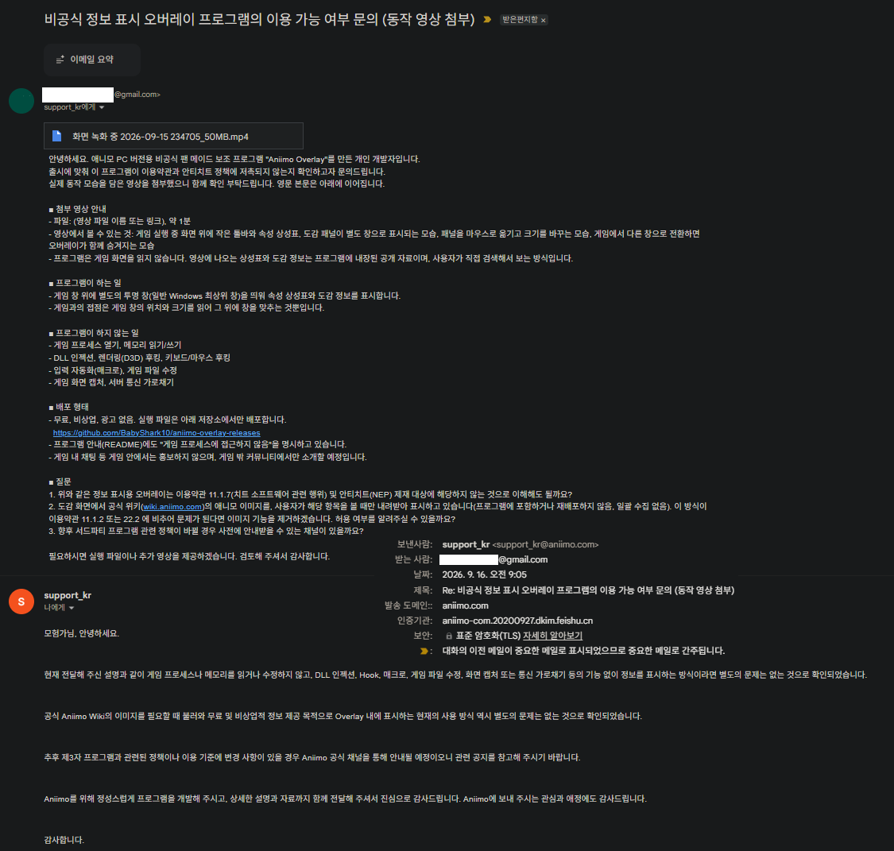

이 확인은 아래 "안전" 절에 적은 동작 방식(메모리 접근·인젝션·후킹·매크로·파일 수정·화면 캡처·통신 가로채기 없음)에 대한 것입니다. 프로그램은 이 범위를 벗어나는 기능을 추가하지 않으며, 정책이 바뀌면 공식 공지를 따릅니다.

## 소개 영상

▶ 위 그림을 누르면 YouTube 에서 재생됩니다. (초기 버전 영상이라 지금 화면과 조금 다릅니다)

## 다운로드
[Releases](https://github.com/BabyShark10/aniimo-overlay-releases/releases/latest) 에서 `AniimoOverlay.exe` 하나만 받으면 됩니다. 설치 없음, 아무 폴더에 두고 실행하세요.

- 처음 실행할 때 Windows SmartScreen 경고가 뜰 수 있습니다 (코드 서명 없음). **"추가 정보 → 실행"** 으로 진행하세요.
- 새 버전이 나오면 툴바에 **[⬆]** 버튼이 켜집니다. 누르면 프로그램 안에서 내려받아 교체하고 다시 실행됩니다. 게임 중에 창을 띄우지 않습니다.
- 지금까지 바뀐 내용은 ≡ 메뉴 > **업데이트 내역** 에서 볼 수 있습니다.

## 시작하기
1. 게임을 실행합니다. 기본 화면 모드인 **테두리 없는 전체 창** 이면 됩니다 (창 모드도 됩니다).
2. `AniimoOverlay.exe` 를 실행합니다. 시작 화면이 잠깐 보인 뒤 트레이 아이콘이 생기고, 게임 화면 위에 작은 **툴바** 가 나타납니다.
3. 툴바 버튼을 눌러 패널을 켜고 끕니다. 버튼에 마우스를 올리면 이름과 단축키가 보입니다.
4. 종료: 툴바 **≡** > 종료, 또는 트레이 아이콘 우클릭 > 종료.

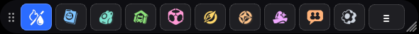

왼쪽부터 상성 · 도감 · 아이템 · 홈랜드 · 포획 · 지도 · 퀘스트 · 지하 궁전 · 파티 모집 · 설정 · ≡ 메뉴.

## 기본 조작 — 이건 꼭 알아 두세요
많이 물어보시는 것들입니다. 대부분 **설정(⚙)** 창에 있습니다.

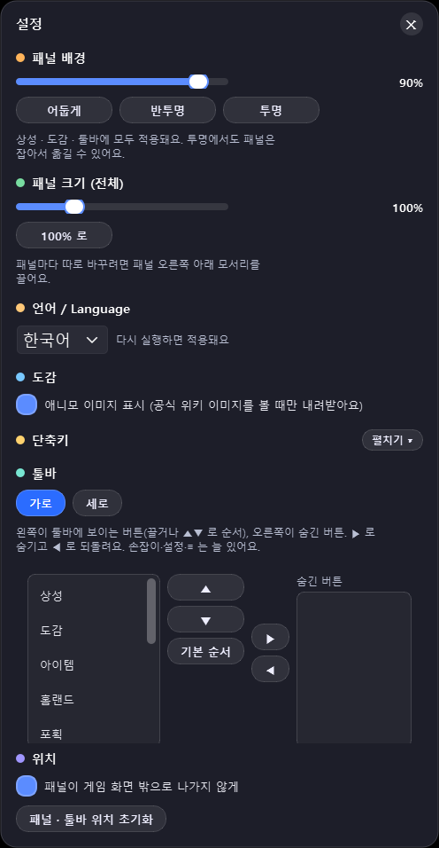

- **패널 옮기기**: 패널의 빈 곳을 잡고 끕니다. 툴바는 왼쪽 손잡이(⋮⋮)를 잡고 끕니다.
- **패널 하나만 크기 바꾸기**: **패널 오른쪽 아래 모서리를 끌면 그 패널만** 커지고 작아집니다. 설정 > 패널 크기 슬라이더와 `Alt+=` / `Alt+-` / `Alt+0`(100%)은 전체 기준 크기라 모든 패널이 같이 바뀝니다. 모서리로 바꾼 패널별 크기는 따로 기억됩니다.
- **패널 닫기**: 오른쪽 위 ✕, 툴바 버튼을 다시 누르기, 또는 단축키.
- **오버레이 전체 숨기기 / 다시 보이기**: `Alt+Q`. 게임 창이 뒤로 가면 패널도 같이 사라지고, 게임으로 돌아오면 다시 나옵니다.
- **게임 화면 밖으로 빼기**: 설정 > 위치 > **"패널이 게임 화면 밖으로 나가지 않게"** 체크를 끄면 패널을 두 번째 모니터나 게임 창 밖으로 옮겨 둘 수 있습니다. 위치가 꼬였으면 같은 곳의 **[패널 · 툴바 위치 초기화]**.
- **단축키 바꾸기**: 설정 > 단축키 > [펼치기]. 항목마다 원하는 키를 누르면 바뀌고, 겹치는 키는 알려 줍니다. 기본값은 아래 표.
- **툴바 모양**: 설정 > 툴바에서 **가로 / 세로**, 버튼 **순서**(끌거나 ▲▼), **버튼 숨기기**(오른쪽 "숨긴 버튼" 목록으로 ▶ 옮기기 — 안 쓰는 패널은 툴바에서 빼세요).
- **배경**: 설정 > 패널 배경 슬라이더 또는 어둡게 / 반투명 / 투명. 투명이어도 패널은 잡아서 옮길 수 있습니다.
- **언어**: 설정 > 언어 / Language. 다시 실행하면 적용됩니다. 도감·아이템·지역 이름도 영어로 바뀝니다.

### 기본 단축키
| 키 | 동작 |
|---|---|
| `Alt+Q` | 오버레이 전체 표시 / 숨김 (`Alt+Shift+Q` 보조) |
| `Alt+T` | 상성 |
| `Alt+D` | 도감 |
| `Alt+I` | 아이템 도감 |
| `Alt+H` | 홈랜드 계산기 |
| `Alt+C` | 포획 확률 |
| `Alt+M` | 지도 |
| `Alt+G` | 지하 궁전 찾기 |
| `Alt+S` | 설정 |
| `Alt+=` / `Alt+-` / `Alt+0` | 패널 크게 / 작게 / 100% |

퀘스트 도우미와 파티 모집은 기본 단축키가 없고, 설정에서 붙일 수 있습니다. 게임의 키와 겹치면 바꿔 쓰세요.

## 상성
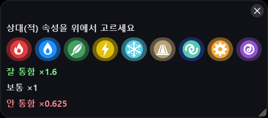

상대(적) 속성을 위에서 고르면 내 공격이 잘 통하는 속성(×1.6) / 보통(×1) / 안 통하는 속성(×0.625)이 색으로 보입니다. 표는 게임 클라이언트의 상성 데이터 기준입니다.

## 도감
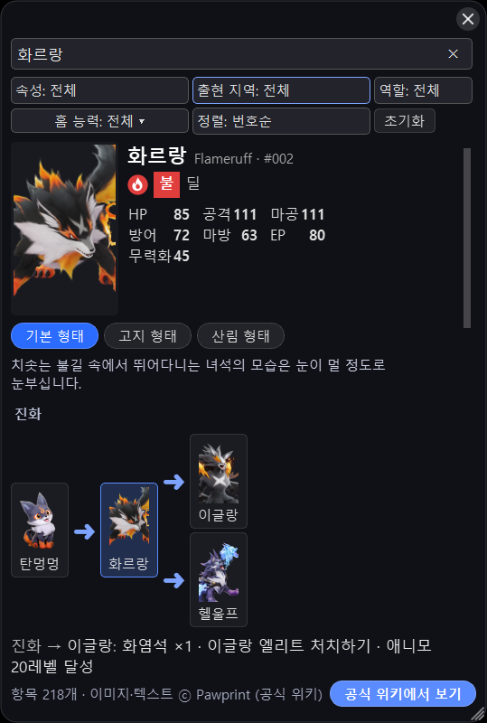

이름(옛 이름·영문도 됨)이나 `#번호` 로 검색합니다. 형태 버튼으로 지역 형태를 오가고, 진화 그림을 누르면 그 애니모로 이동합니다. 아래로 내리면 설명·특성·스킬·행동 능력(비행·등반·수영)·홈 능력, 출현 지역과 **출현 조건**(시간대·날씨), **출현 방식**(출현 지점 수, 부숴야 나오는 오브젝트, NPC 대전 전용 등), **MBTI 추천**(전투용·홈 작업용)이 나옵니다.

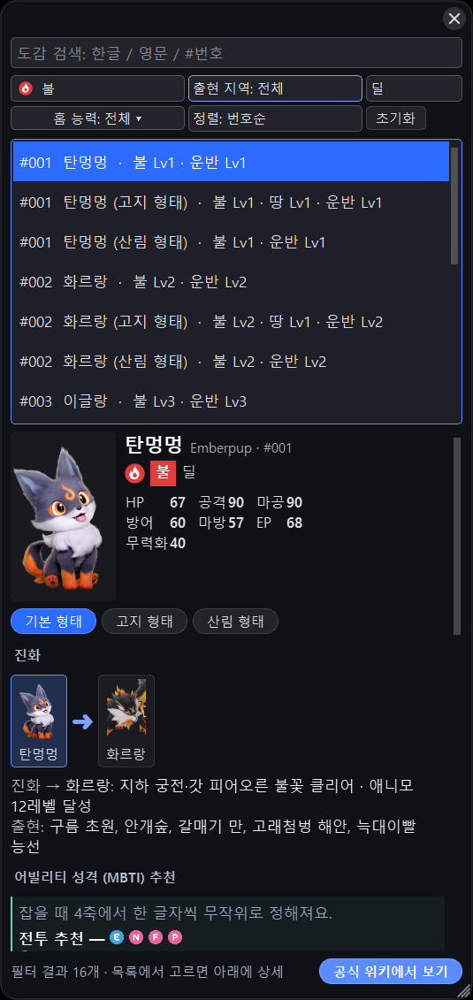

속성 · 출현 지역 · 역할 · 홈 능력으로 걸러 목록에서 고릅니다. 홈랜드에 넣을 애니모를 찾을 때 홈 능력 필터가 편합니다. 정보는 프로그램 안에 들어 있어 오프라인에서도 되고, 전신 이미지만 볼 때 공식 위키에서 받아 저장합니다 (설정 > 도감에서 끌 수 있음).

## 아이템 도감
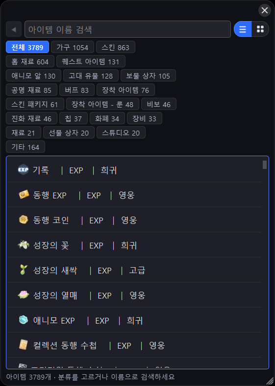 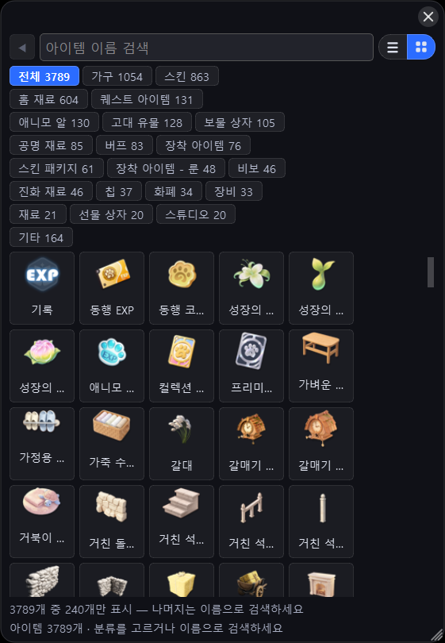

분류 칩으로 좁히거나 이름으로 검색합니다. 이름을 모르면 오른쪽 위 격자 버튼으로 **아이콘 보기**. 아이템을 누르면 효과·획득 방법·사용처가 나오고, 재료를 누르면 그 아이템으로, 진화 재료의 애니모를 누르면 도감으로 이어집니다.

## 지도
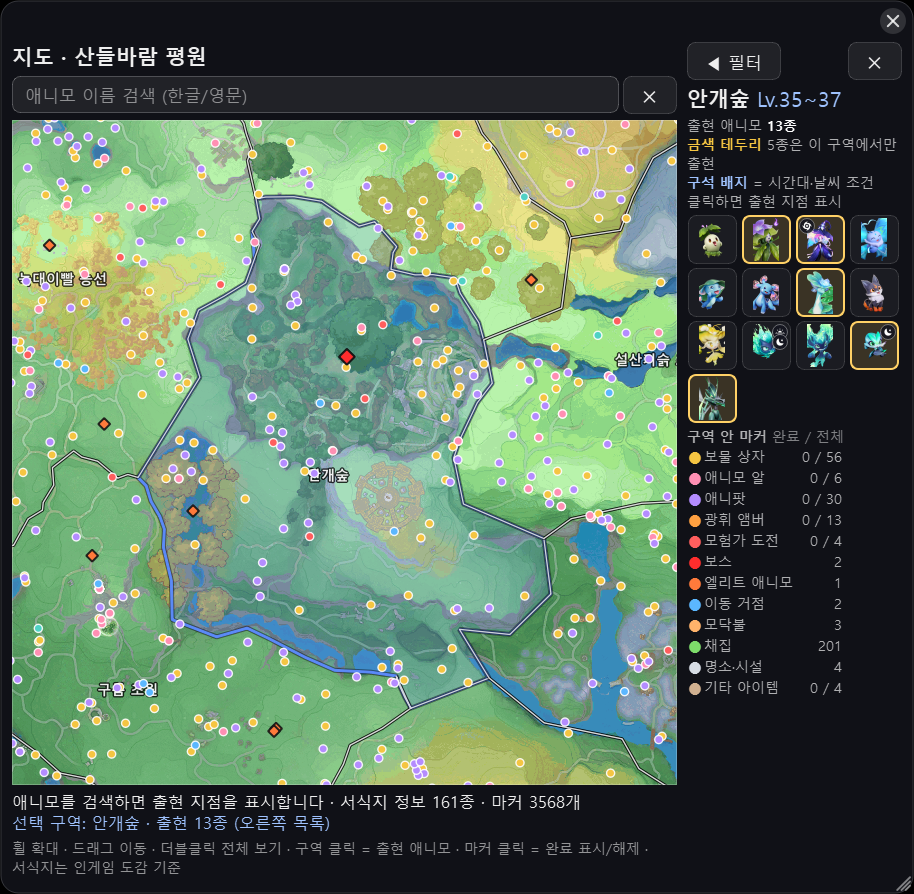

산들바람 평원 전체 지도입니다. 휠로 확대(원본 해상도), 드래그로 이동, 더블클릭으로 전체 보기.

- **구역을 클릭**하면 오른쪽에 그 구역에 나오는 애니모가 인게임과 같은 순서로 나옵니다. 금색 테두리는 그 구역에서만 나오는 종, 구석 배지는 시간대·날씨 조건입니다. 썸네일을 누르면 출현 지점이 지도에 찍힙니다.
- **애니모 이름을 검색**하면 어느 구역이든 출현 지점을 표시합니다.
- **마커**: 보물 상자 · 애니모 알 · 애니팟 · 광휘 앰버 · 모험가 도전 · 보스 · 엘리트 · 이동 거점(순간이동) · 모닥불 · 채집 · 명소·시설. [◀ 필터]에서 종류를 켜고 끄고, 상자·알처럼 한 번 얻는 것은 **마커를 클릭해 완료 표시** 하면 구역별로 남은 개수가 보입니다. 완료 기록은 내 PC 에만 저장됩니다.

## 홈랜드 계산기
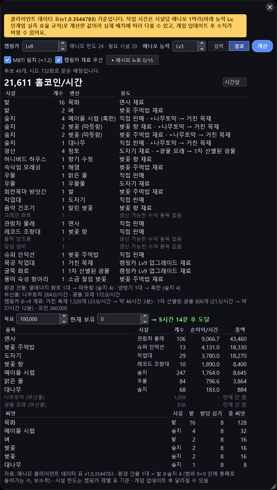

[입력] 탭에서 캠핑카 레벨과 애니모 능력 레벨을 넣으면 시설 한도가 채워집니다. 보유 시설 개수와 레벨, 모듈 레벨을 맞추고 [계산]을 누르면 [결과] 탭에 **어느 시설이 무엇을 만들어야 시간당 홈코인이 가장 큰지**, 목표 금액까지 걸리는 시간, 품목별 순이익, 필요한 씨앗 수가 나옵니다.

- **캠핑카 재료 우선**: 목공 작업대·굴뚝 화로가 다음 캠핑카 레벨 재료를 만들고, 필요 수량과 걸리는 시간을 보여 줍니다.
- **MBTI 일치**: 시설과 성격이 맞는 애니모를 넣었을 때의 효율(×1.2)로 계산합니다.
- **레시피 노트**: 갖고 있는 노트만 골라 반영합니다.
- 생산 시간·판매가·레시피는 게임 클라이언트 데이터 기준이고, 패널 위에 데이터 버전이 표시됩니다. 작업 시간은 시설당 애니모 1마리로 계산한 값이라 실제 배치와 조금 다를 수 있습니다.

## 포획 확률
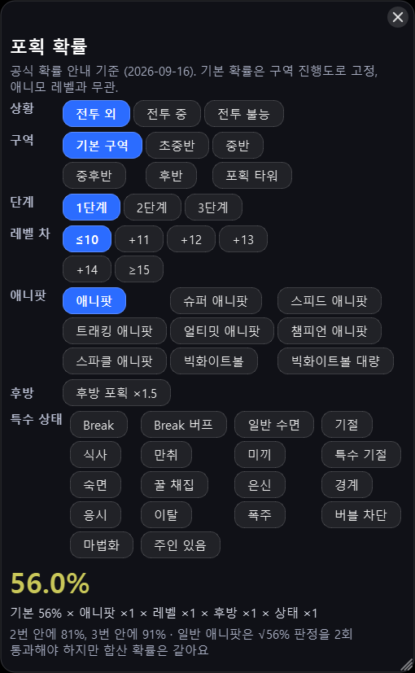

상황(전투 외 / 전투 중 / 전투 불능) · 구역 · 단계 · 레벨 차 · 애니팟 · 후방 · 특수 상태를 고르면 최종 확률과 계수별 내역, 2번·3번 안에 잡힐 확률이 나옵니다. 수치는 게임 공식 안내([확률 공식](https://www.aniimo.com/ko/formula-multipliers))를 그대로 씁니다.

## 퀘스트 도우미
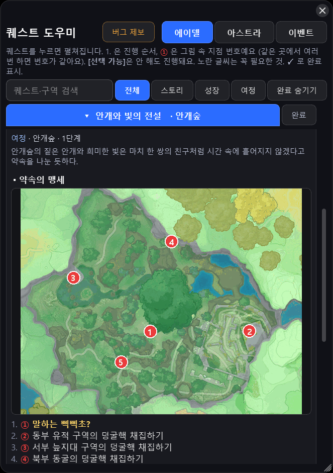

에이델 · 아스트라 퀘스트를 분류별로 보여 주고, 퀘스트를 누르면 **지도에 번호로 찍은 위치 그림** 과 번호 붙은 단계 설명이 나옵니다. 꼭 필요한 애니모·아이템·조건은 노란색, [선택 가능]은 안 해도 진행됩니다. **수수께끼 정답**(큰 모자를 쓴 애니모 같은 것)도 적혀 있습니다. ✓ 로 완료 표시하고 [완료 숨기기]로 정리하세요.

**이벤트** 탭에는 기간 한정 이벤트를 모아 둡니다. '내가 누구게'는 회차별 정답 애니모와 형태, 출현 지점·텔레포트 지점 그림, 규칙과 무효 조건을 보여 주고, 지금 진행 중인지 예정인지 종료됐는지 기간과 함께 표시합니다.

안내가 실제와 다르면 패널의 **버그 제보** 버튼으로 알려 주세요.

## 지하 궁전 찾기 (알 쟁탈전)
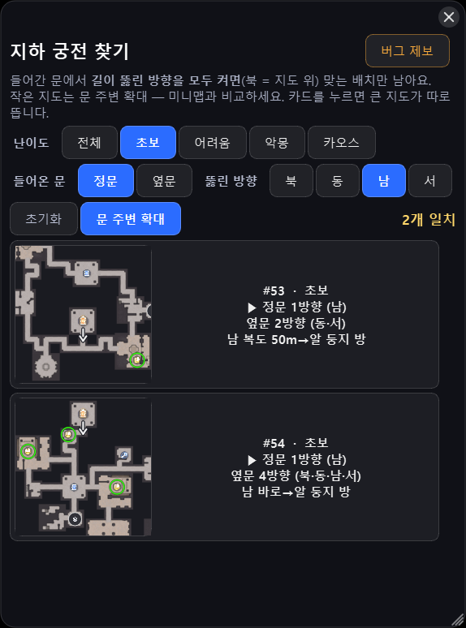

알 쟁탈전 팀 모드의 지하 궁전은 30가지 배치 중 하나입니다. 난이도와 **들어간 문(정문/옆문)**, 그 문에서 **길이 뚫린 방향** 을 모두 켜면 맞는 배치만 남습니다. 카드의 작은 지도는 문 주변을 확대한 것이라 미니맵과 비교하기 쉽고, 카드를 누르면 큰 지도가 따로 뜹니다. 알 둥지(초록 테두리)·열쇠 방·열쇠 문·시간 제한 도전은 인게임 마커 아이콘으로 표시됩니다.

## 파티 모집 (알 쟁탈전)
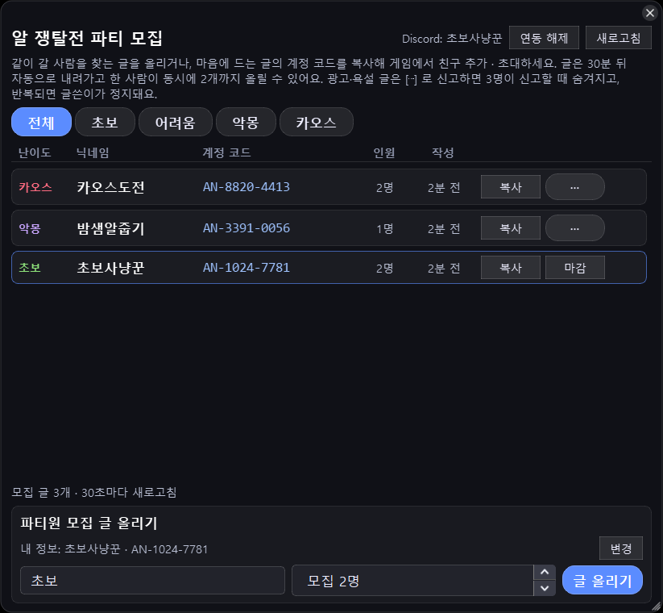

알 쟁탈전 같이 갈 사람을 구하는 게시판입니다. 난이도(초보 · 어려움 · 악몽 · 카오스)별로 글을 올리고, 마음에 드는 글의 **계정 코드를 [복사]** 해 게임에서 친구 추가 · 초대하면 됩니다. 파티는 본인 포함 3명이라 모집 인원은 1~2명입니다.

- **Discord 연동이 필요합니다** (이 기능만). 도배와 신고 처리를 위해서이고, 앱은 Discord 이름과 아이디만 받습니다. 이메일·서버 목록은 받지 않고, 다른 기능은 연동 없이 그대로 쓸 수 있습니다.
- 처음 연동하면 **애니모 닉네임과 계정 코드** 를 등록합니다. 글에 표시되는 정보라 한 번은 바로 바꿀 수 있고, 그다음부터는 변경 신청을 하면 운영자가 확인한 뒤 바뀝니다.
- 글은 30분 뒤 자동으로 내려가고, 한 사람이 동시에 2개까지 올릴 수 있습니다. 내 글은 [마감]으로 바로 내립니다.
- 광고·욕설 글은 [⋯] 로 **신고** 하거나 **그 사람 글 숨기기(차단)** 할 수 있습니다. 여러 사람이 신고하면 숨겨지고, 반복되면 글쓴이가 정지됩니다. 차단 목록은 Discord 계정에 저장돼 다른 PC 에서도 같습니다.
- 다른 PC 에서 쓰려면 그 PC 에서 한 번 더 [Discord 로 연동하기]를 누르면 됩니다 (Discord 승인은 한 번이면 다음부터 클릭 한 번).

## 안전
- 게임 프로세스에 접근하지 않습니다. 메모리 읽기, 인젝션, 후킹, 자동 조작, 화면 캡처, 통신 가로채기가 없습니다. 별도의 투명 창을 게임 창 위에 얹는 방식입니다.
- 이 동작 방식과 공식 위키 이미지 표시에 대해 Aniimo 고객지원에 문의해, 현재 방식은 별도의 문제가 없다는 답변을 받았습니다 (위 "개발사 확인"). 제3자 프로그램 정책이 바뀌면 공식 공지를 따릅니다.
- **익명 사용 통계**: 설치 때 만든 무작위 ID, 프로그램 버전, 실행/업데이트 여부, 오류가 났을 때의 오류 코드(예: AO-3004)만 전송해 사용자 수와 오류 빈도를 파악합니다. 이름·이메일·IP·게임 정보·개인 파일 경로는 보내지 않습니다.
- **파티 모집**: Discord 연동 시 Discord 사용자 id·표시 이름, 등록한 애니모 닉네임·계정 코드, 올린 글(30분 뒤 삭제), 차단 목록이 서버에 저장됩니다. 그 외 기능은 서버에 아무것도 보내지 않습니다.
- 실행 파일은 이 저장소의 Releases 에서만 배포됩니다. 다른 곳에서 받은 파일은 신뢰하지 마세요. `latest.json` 의 sha256 으로 검증할 수 있습니다.

## 라이센스
개인 사용 무료입니다 ([LICENSE.md](LICENSE.md)). Qt 등 포함된 외부 라이브러리 고지는 [THIRD_PARTY_NOTICES.md](THIRD_PARTY_NOTICES.md) 에 있습니다. 게임 이미지·데이터의 권리는 Pawprint 에 있으며 비상업 정보 제공 목적으로만 사용합니다.

## 문제 신고 · 건의
[Issues](https://github.com/BabyShark10/aniimo-overlay-releases/issues/new/choose) 에서 **"오류 / 문제 신고"** 또는 **"건의 / 기능 요청"** 을 골라 올려 주세요. 프로그램 안에서는 ≡ 메뉴의 "문제 신고 · 건의" 로 바로 갈 수 있습니다. 있으면 좋겠다 싶은 기능, 불편한 점, 잘못된 데이터(상성·도감·홈랜드 수치)도 모두 환영합니다. 영어 번역 수정 제안은 `i18n/` 폴더의 파일을 참고해 주세요.

오류나 갑작스런 종료를 신고할 때는 아래 내용이 함께 있으면 원인을 훨씬 빨리 찾을 수 있습니다.

1. **오류 코드**: 안내 창에 `(오류 코드 AO-xxxx)` 가 보였다면 그 코드.
2. **로그 파일**: 트레이 아이콘 우클릭 → **로그 폴더 열기** 안의 `log.txt` (마지막 부분만 붙여 넣어도 됩니다). 직접 찾으려면 탐색기 주소창에 `%LOCALAPPDATA%\AniimoOverlay`.
3. **프로그램 버전**: ≡ → 정보, 또는 트레이 아이콘에 마우스를 올리면 나오는 `v1.x.x`.
4. **무엇을 하다가 그랬는지**: 예) "도감에서 화르랑을 검색하고 진화 그림을 눌렀을 때 꺼짐". 게임 화면 모드와 모니터 구성(개수, 배율)도 도움이 됩니다.
5. **스크린샷**: 오류 창이나 이상하게 그려진 화면이 있으면 캡처.

프로그램이 갑자기 꺼졌다면 다음 실행 때 원인 코드가 자동으로 익명 보고되므로, 한 번 더 실행해 주시면 도움이 됩니다.
